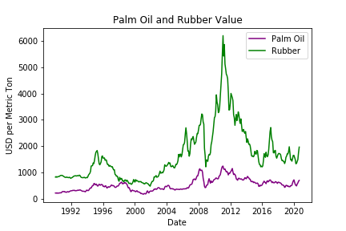

## ETL-Project: Extract, Transform & Load --- Commodities
## By: The Git Pandas- Kelsey Cox, Stanley Tan, Dominica Corless, Jeremy Steele & Jeremy Jang

For our ETL project, we decided to think literally and deeply about what data was best to **'Extract'** and **'Tranfsorm'**.
 And what better time to salute the land of opportunity than election month? :metal:  
 The United States is known for EXTRACTING and TRANSFORMING its rich and abundant natural resources and more simply put, ***hot COMMODITIES***. :wink: 

Commodities are economic goods that hold physical and functional value and have been actively traded in global commodity markets for decades.
 We decided to focus our ETL project on our nation's most popular commodities, since they are in essence extracted and transformed themselves! 
 We will be 'ETL-ing' our data on the following commodities: **Precious Metals, Natural Gas, and Agriculture staples including Livestock and Crops.** 

## Technical Report

### Database Design

We chose to use a PostgreSQL database for our collected data.

#### Entity Relationship Diagram

### Accessing and Graphing Data

## Precious Metals:
"In America, the streets are paved in Gold!" - Anonymous
 # Precious Metals: :moneybag:
 Precious metals like gold, silver, platinum and palladium prove to be dependable investments and hold industrial value so they are actively traded in global markets. 
 Kelsey used data from Quandl and pulled APIs for gold (AU), silver (AG), platinum (PT) and palladium (PD). The APIs provided daily fixing prices (globally recognized prices) from Monday 1/4/1999 to Friday 11/6/2020. Kelsey JSONified her APIS and used Pandas to create and clean the dataframes in order to provide the date and price (USD) for each trading day.  

Sources: Quandl APIs
* https://www.quandl.com/data/LBMA/GOLD-Gold-Price-London-Fixing
* https://www.quandl.com/data/LBMA/SILVER-Silver-Price-London-Fixing
* https://www.quandl.com/data/LPPM/PALL-Palladium-Fixing
* https://www.quandl.com/data/LPPM/PLAT-Platinum-Fixing

## Natural Gas:
“Natural gas is a feedstock in basically every industrial process.” - Aubrey McClendon :fuelpump:

## Agriculture:
"Agriculture is the most healthful, most useful and most noble employment of man." - George Washington. :corn:
 "Once you kill a cow, you gotta make a burger." - Dean Koontz :cow2:   
 "We really owe a great deal to the rubber tree." - Mechai Viravaidya  :factory:  

## Other Commodities

Sources:
* Palm Oil -
 International Monetary Fund, Global price of Palm Oil [PPOILUSDM], retrieved from FRED, Federal Reserve Bank of St. Louis; [https://fred.stlouisfed.org/series/PPOILUSDM](https://fred.stlouisfed.org/series/PPOILUSDM), November 9, 2020.
* Rubber -
 International Monetary Fund, Global price of Rubber [PRUBBUSDM], retrieved from FRED, Federal Reserve Bank of St. Louis; [https://fred.stlouisfed.org/series/PRUBBUSDM](https://fred.stlouisfed.org/series/PRUBBUSDM), November 8, 2020.

